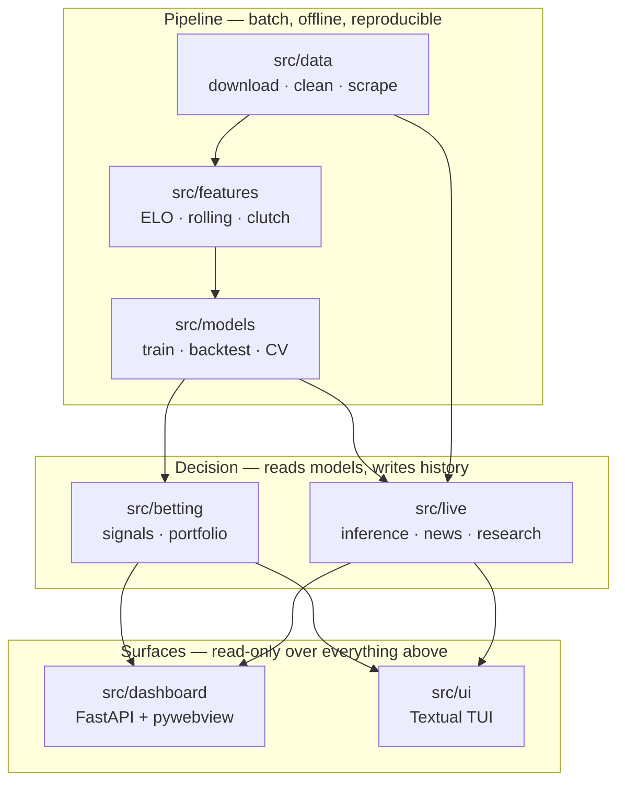
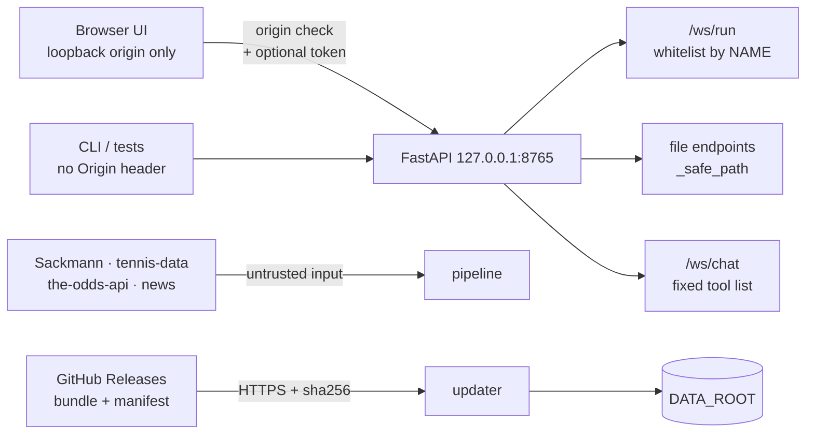

# Architecture

The README shows what flows where. This file explains why the pieces are cut
where they are, and which properties the shape exists to protect. Read it before
moving a boundary.

The project has one non-negotiable claim — **that its accuracy numbers are
honest** — and one awkward fact: the same repository is a research pipeline *and*
a desktop application that runs code, opens terminals and talks to a local LLM.
Most of what follows is those two facts arguing with each other and the outcome
being written down.

---

## 1. The invariant the design serves

An ML result is only worth the evaluation that produced it. Three leaks were
found in this project's history, and all three were possible because some part of
the future had reached the training set. So leak-freedom is not a convention
here; it is a structural property, enforced at the seams:

| Rule | Where it lives | What breaks without it |
|---|---|---|
| Temporal split only — train < validation < `test_start_year` | `config/config.yaml`, `src/models/train.py` | a random split lets a 2026 match teach the model about a 2024 one |
| Perspective randomization | `src/models/train.py` | raw rows are winner-POV (`w_*`/`l_*`); un-randomized evaluation is inflated by construction, not by a bug |
| Train-only imputation | `src/models/train.py` | medians computed over the whole dataset carry test-set information into training |
| Perspective pairs — every `w_X` has its `l_X` | `_enforce_perspective_pairs` | a lone one-sided feature *is* the label wearing a hat |
| Tilt probe on every new feature | `scripts/probe_feature_tilt.py` | a single feature that guesses the winner >70% is a leak, and looks like a breakthrough |

**Consequence for anyone changing the pipeline:** these are not lint rules to be
satisfied. A change that makes one of them awkward is a change to the project's
central claim, and needs a before/after `train` + `backtest` run in
`models/atp_metrics.json` — not an argument.

---

## 2. Layers, and the direction of dependency

**The rule is one-directional and absolute: nothing in `pipeline` or `decision`
may import from `surfaces`.** The pipeline has to be runnable with no UI present
— that is what makes it reproducible on a server, in CI, and inside the scheduled
loops. Both surfaces are consumers of the same artifacts, and neither is
privileged: the desktop app and the TUI read the same `betanalytix.db` and the
same `models/atp_metrics.json`, which is why a number can never differ between
them.

## 3. Stages hand off through files, not function calls

Each pipeline stage ends by writing an artifact and the next stage begins by
reading it:

| Stage | Reads | Writes |
|---|---|---|
| `data.download` | Sackmann repos, tennis-data.co.uk | `data/raw/**` |
| `data.clean` | `data/raw/**` | `data/processed/*_unified.csv` |
| `features.build_features` | `data/processed/*` | `data/features/*_features.csv` |
| `models.train` | `data/features/*` | `models/*.pkl`, scaler, medians, `models/atp_metrics.json` |
| `models.backtest` | models + real odds | `models/atp_metrics.json`, `reports/metrics_history.csv` |
| `live.inference` | models + `data/live/current_odds.csv` | `data/live/predictions.json` |
| `betting.signals` | predictions + sharp consensus | `data/live/signals_log.csv` |
| `betting.portfolio` | user actions | `data/betanalytix.db` |

This looks old-fashioned next to an in-memory pipeline object, and it is
deliberate. A file boundary is **inspectable** — when a metric moves, you can
diff the artifact and find the stage that moved it — and it is **resumable**:
feature building takes ~20 minutes, and nothing downstream should have to pay for
that twice. It also means every stage is independently runnable, which is what
lets the whitelist in §5 expose them as eight separate buttons instead of one
opaque "run everything".

The cost is real and worth stating: the artifacts are not versioned against the
code that produced them. A stale `*_features.csv` next to a new
`build_features.py` will train happily and silently. `models/atp_metrics.json`
carries the run's numbers, and `reports/metrics_history.csv` the history, which
is the current mitigation — not a solution.

The one contract that is *not* a file is `prepare_training_data`'s 13-tuple
(X/P/y per split, plus scaler, feature names, medians, player mapping). It is
awkward on purpose: it is the single point where the train/validation/test
separation is materialised, and making it one object would make it easy to pass
the wrong split.

## 4. Two roots, because a packaged app is not a checkout

`src/runtime_paths.py` resolves every runtime path through exactly two roots:

- **`BUNDLE_DIR`** — read-only, ships *inside* the app. `sys._MEIPASS` in a
  PyInstaller build, the repo root in a source checkout. Static UI assets, the
  seed models and the default config live here.
- **`DATA_ROOT`** — writable and persistent. The repo root in dev; the per-OS
  application-data directory when frozen (`%LOCALAPPDATA%`,
  `~/Library/Application Support`, `$XDG_DATA_HOME`). The user's
  `betanalytix.db`, downloaded model updates, chat settings and live caches live
  here. `UNABETTING_DATA_DIR` overrides it for portable installs.

In a source checkout the two are the same path, so development behaves exactly
as it always did — which is why the split survives: it costs a contributor
nothing to ignore.

`seed_data_root()` copies the bundled seed into `DATA_ROOT` on first launch and
**never overwrites an existing file**. That single rule is what makes a reinstall
or an update non-destructive: a user's wagering history is in `DATA_ROOT`, and
the installer physically cannot reach it.

## 5. Trust boundaries

The app runs locally, so the interesting question is not "who is the remote
caller" but "what can a local page, a malicious download or a tampered bundle do
to someone who runs this".

What each boundary actually enforces:

- **Binding.** `HOST = "127.0.0.1"` in `src/dashboard/config.py`, never
  `0.0.0.0`. Nothing downstream assumes an authenticated remote caller, because
  there is not supposed to be one.
- **Origin.** `browser_request_is_cross_origin` rejects `Sec-Fetch-Site:
  cross-site` and any `Origin` that is not `http://127.0.0.1:8765` or
  `localhost` on the same port — down to refusing credentials, a path, a query
  or a fragment in the origin. A **missing** `Origin` is allowed on purpose:
  that is the CLI and the test client, which are not browsers and cannot be
  driven by a malicious page.
- **Token.** `DASHBOARD_TOKEN`, when set, is additionally required on the
  WebSockets. Read dynamically rather than captured at import, so tests can set
  it — and so enabling it does not need a restart.
- **The runner takes a name, not a command line.** `/ws/run` accepts one of the
  eight keys in `COMMAND_WHITELIST` and looks up the argument vector itself;
  `create_subprocess_exec` runs it with no shell. The client cannot express a
  command that is not already in the map. Free-form execution exists in the app —
  it is the *terminal* WebSocket, which is honest about being a terminal.
- **File endpoints go through `_safe_path`.** A path from a request cannot
  escape the directories it is allowed to read.
- **The in-app LLM picks from a fixed tool list** and cannot reach anything the
  whitelist does not already name. Widening that list is a human review, not a
  config change.
- **CSP** is set on every response by one middleware, with `object-src 'none'`
  and `base-uri 'none'`.

**The one gap, stated plainly:** the updater verifies every bundle member's size
and SHA-256 against a manifest that ships *inside the same zip*. That is
integrity, not authenticity — it proves the download was not corrupted, not who
built it. The bundle contains pickled models, and `joblib.load` executes code by
construction, so anyone who can serve a bundle the client accepts gets code
execution. Trust currently rests entirely on HTTPS to this project's own GitHub
Releases. The fix is to sign the manifest against a key baked into the read-only
`BUNDLE_DIR`; until then the updater must not be pointed anywhere else.
`tests/test_updater.py` pins what *is* enforced.

## 6. Cross-platform, without pretending the platforms are the same

Windows is a first-class target — that is where the app is used — and Linux and
macOS must keep working. The rule is that every OS-specific import is guarded and
has a working fallback: `winpty` / `pty`, `webview` / `--browser`, `pygame` /
silence. Two places where the difference is real rather than cosmetic:

- **Terminals.** ConPTY through `pywinpty` on Windows, the standard-library `pty`
  on POSIX, behind one `pty_process.py` interface. `tests/test_dashboard_terminal.py`
  skips the POSIX path on Windows rather than mocking it — a mocked PTY test
  proves the mock works.
- **The window.** `pywebview` gives a native window on Windows; elsewhere the
  same FastAPI app is served to a browser with `--browser`, and `--server-only`
  drops the window entirely for headless use.

## 7. What is deliberately not abstracted

- **No ORM.** `betanalytix.db` is SQLite reached through explicit SQL. The schema
  is small, the queries are the interesting part, and an ORM would hide the one
  thing worth reading.
- **No frontend build step.** Vanilla JS, themes as CSS variables, strings
  through a `t()` dictionary. The app must be launchable from a fresh clone with
  `pip install -r requirements.txt` and nothing else; a node toolchain would be a
  second thing that can break before the first window opens.
- **No abstraction over the model zoo.** `train.py` knows it is training XGBoost,
  LightGBM and a PyTorch ensemble. A `Model` interface would buy nothing: the
  calibration and the leak-free plumbing are the shared part, and they are shared
  already.

## 8. Known structural gaps

Kept here rather than in issues, because they are properties of the shape:

1. **Artifacts are not versioned against the code that produced them** (§3). A
   stale feature file trains silently.
2. **The updater's manifest gives integrity, not authenticity** (§5).
3. **`data/raw/TML-Database/` is required by ATP cleaning and nothing clones it.**
   A fresh clone gets through `download` and stops at `clean`.
4. **`src/dashboard/data_api.py` is 1 348 lines** and holds twenty-six endpoints
   across six unrelated concerns — bets, files, media, model, updater, chat
   config. The router-per-concern split it wants would be routine; it has not
   been done, and the file is the first place a reader gets lost.

---

## Where to look next

| Question | File |
|---|---|
| Why a boundary is where it is, one decision per file | [`docs/adr/`](docs/adr/) |
| What the app actually exposes over HTTP and WebSocket | [`docs/API.md`](docs/API.md) |
| How the scheduled agents work, and what they may not do | [`docs/LOOPS.md`](docs/LOOPS.md) |
| What the numbers currently are, honestly | `README.md`, `models/atp_metrics.json` |
| What was tried, and what it did | `EXPERIMENTS.md`, `reports/metrics_history.csv` |
| Where the data comes from and what its licence demands | `DATA_SOURCES.md` |
| How to report a vulnerability, and what is in scope | `SECURITY.md` |
| How to work on this | `CONTRIBUTING.md`, `CLAUDE.md` |
