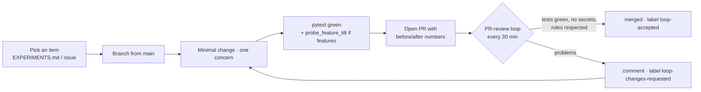

# Contributing to UnaBetting

Thanks! This project lives on methodological rigor: the value isn't "more accuracy",
it's **accuracy proven honestly**.

## The golden rule: no leaks

Every change to features / training / evaluation MUST respect:

1. **Temporal split** — train on past years, test on 2025+ — never a random split.
2. **Randomized perspective** — raw data has `w_` = winner; any evaluation on
   non-randomized rows is inflated by construction (see
   `docs/obsidian/Backtest_e_Metriche_Oneste.md` for the historical disasters).
3. **Train-only imputation** — medians computed on the train set, never on the full dataset.
4. **Perspective pairs** — every `w_X` feature must have its `l_X` twin
   (`_enforce_perspective_pairs` guarantees it — don't bypass it).
5. **Tilt check** — new feature? run `python scripts/probe_feature_tilt.py`. If a single
   feature "guesses" the winner > 70% of the time, it's a leak, not a signal.

## Contribution flow

### Steps

1. Pick an item from `EXPERIMENTS.md` (or propose one via an issue).
2. Branch from `main`, make the smallest viable change — **one concern per PR**.
3. Evaluate: `python -m src.models.train` + `python -m src.models.backtest` +
   `python -m pytest tests/`.
4. Open a PR with the **before/after numbers** (accuracy, log loss, ROC) and how you
   obtained them. A claim without reproducible numbers gets respectfully rejected.

A PR-review loop checks open PRs every 30 minutes: it runs the tests, scans for
secrets/personal data, verifies the leak-free rules, then **merges** good PRs (labelling
them `loop-accepted`) or **requests changes** with specific feedback.

## Environment setup

See the Quick start in the [README](README.md). On Windows the desktop app uses
pywebview/WebView2 and pywinpty; on Linux/macOS run `python -m src.dashboard --browser`.

## What NOT to commit

`.env` (API keys), `data/` (regenerable datasets), personal DBs (`betanalytix.db`),
personal screenshots/logs, video render artifacts (`*.mp4`). The `.gitignore` already
covers these: if `git status` shows a personal data file, stop and check.

## Style

Python: follow the surrounding code (light type hints, short docstrings, comments only
where the code doesn't speak for itself). Frontend: vanilla JS, no build step.
**Language: English** — code, comments, docs, commit messages, and PRs are all in English.
