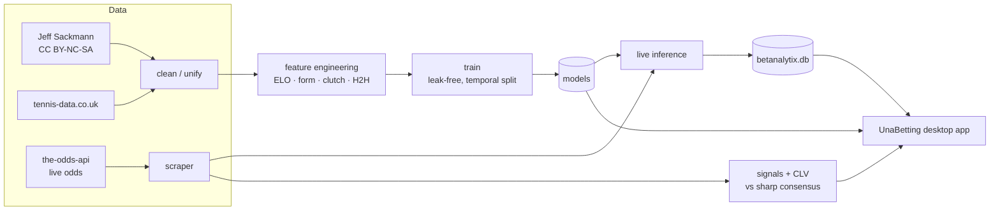
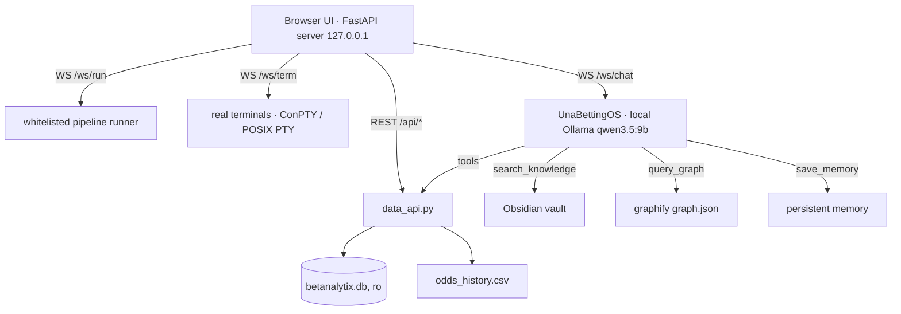
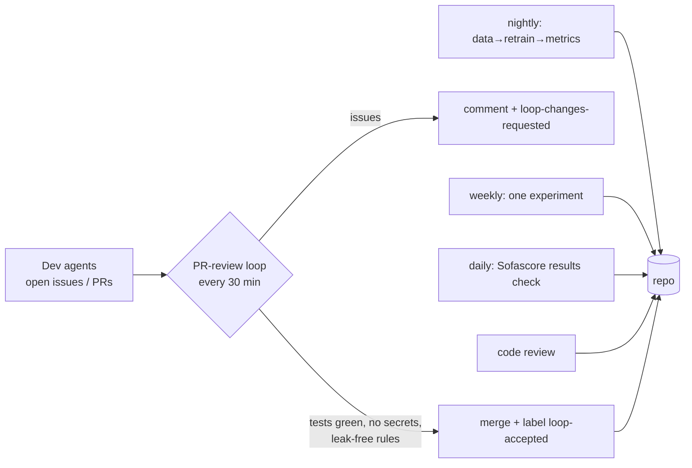

# 🎾 UnaBetting — Tennis Analytics & Honest ML


Open-source tennis analytics (ATP/WTA): a **leak-free ML pipeline**, professional-grade
bet tracking, CLV measurement against sharp lines, and **UnaBetting** — a desktop app
with a data cockpit, integrated terminals, a 3D knowledge graph, an agentic web browser,
and a local-LLM memory core.

**[▶ Explore the live 3D knowledge graph](https://una-betting.vercel.app/graph3d.html)** · **[📖 Docs — deep dive](https://una-betting.vercel.app/docs.html)** · **[Website](https://una-betting.vercel.app/)**

<!--METRICS-->
**Current honest numbers** (test 2025+, updated 2026-06-12): model accuracy **67.4%** · log loss 0.601 · ROC 0.740 · odds-ensemble 69.6% on real-odds rows · honest backtest ROI **-29%** (negative — no betting edge).
<!--/METRICS-->

> ## ⚠️ Honest disclaimer (please actually read it)
> This project's ML model reaches **~67% accuracy** on the out-of-sample 2025+ test set,
> but **has no proven predictive edge**: the honest backtest **loses money** to the
> bookmaker margin. This is a tool for **research, tracking and methodological
> discipline** (CLV, leak detection, bankroll management) — **not** a money machine.
> If you bet: only with licensed operators (in Italy: an ADM concession), only money
> you can afford to lose, 18+. Gambling can be addictive.

## What's inside

| Component | Description |
|---|---|
| **ML pipeline** | ELO (overall / surface / style), form, fatigue, clutch, H2H, de-vigged odds; strict temporal training (train < 2024, test 2025+), anti-leak perspective randomization, train-only medians |
| **UnaBetting app** | Native desktop window (pywebview): data cockpit, file explorer + editor, whitelisted pipeline runner, real terminals (PowerShell / WSL / tmux), agentic web browser, media preview, bet tracker with equity curve, **UnaBettingOS** local-LLM memory core, 3D knowledge graph, 6 themes, 5 UI languages |
| **Anti-leak** | This project's history is a leak hunt (3 found and fixed, all documented). Regression tests in `tests/`, chronology in `docs/obsidian/`. |
| **CLV infra** | Scheduled multi-book odds snapshots, sharp no-vig consensus (Pinnacle/Betfair), Closing Line Value per signal — the metric of truth |
| **Self-evolving loops** | Scheduled headless agents: nightly maintenance, weekly experiments, daily results check (Sofascore), code review, and a PR-review loop that reviews & merges contributions |

## Architecture



## Data flow inside the app



## Self-evolving loops



## Quick start

```bash
git clone https://github.com/SandroHub013/UnaBetting.git
cd UnaBetting
pip install -r requirements.txt
cp .env.example .env        # add your API keys (the-odds-api; openrouter optional)

python -m src.data.download           # Sackmann data + historical odds (tennis-data.co.uk)
python -m src.data.clean              # unified dataset
python -m src.features.build_features # feature engineering (~20 min)
python -m src.models.train            # multi-model training + calibration
python -m src.models.backtest         # HONEST backtest (real odds, neutral perspective)

python -m src.dashboard               # UnaBetting (native window on Windows;
                                      # elsewhere: python -m src.dashboard --browser)
```

The in-app chat (UnaBettingOS) defaults to [Ollama](https://ollama.com) with a
tool-calling model (`qwen3.5:9b`, configurable via `CHAT_MODEL`). Its persisted
`chat_settings.json` can instead select the `openrouter` or `openai` provider with an
HTTPS API base URL and an `api_key_env` name such as `OPENROUTER_API_KEY`; the credential
is read from the environment at runtime and is never stored in the settings file.

Browser requests to the dashboard APIs and WebSockets are restricted to the local app
origin. Set `DASHBOARD_TOKEN` before launch to additionally require the same session token
on pipeline, terminal, and chat WebSocket connections; the bundled frontend forwards it
automatically.

## Model features (excerpt)

- **Advanced ELO** — overall + per surface + "style ELO" (vs big servers / returners), adaptive K, time decay
- **Rolling stats** — serve/return/clutch over 10/20/50-match windows, tie-breaks, deciding sets
- **Form & fatigue** — EWM form, decayed minutes over the last 14 days
- **Market** — de-vigged implied probability (B365→PS→Avg) + `has_odds` flag
- **Context** — recent H2H, ranking, age, CPI, points to defend

Three targets: winner (H2H), spread (game diff), totals (over/under).

## Project layout

```
src/
├── data/        download, cleaning, odds scraper (the-odds-api, book allowlist)
├── features/    ELO, player stats, clutch, build_features
├── models/      train (anti-leak), honest backtest, cross-validation
├── betting/     signals (value vs sharp + CLV), portfolio (bet tracker)
├── live/        live inference, news agent, web research
└── dashboard/   UnaBetting app (FastAPI + pywebview + xterm.js)
scripts/         pipeline helpers + loops/ (scheduled agent prompts) + diagnostics/
docs/            internal docs + obsidian/ vault
```

## Contributing

See [CONTRIBUTING.md](CONTRIBUTING.md). The priority backlog lives in
[EXPERIMENTS.md](EXPERIMENTS.md). The project's golden rule: **every accuracy claim must
be proven leak-free** (temporal test, randomized perspective, train-only medians) — otherwise
it's a bug, not a result.

## Data: licenses & attribution

The data is **not** ours. In particular, **Jeff Sackmann / Tennis Abstract** datasets are
[CC BY-NC-SA 4.0](https://creativecommons.org/licenses/by-nc-sa/4.0/): attribution required
and **non-commercial use only** — a constraint that extends to any use of this project built
on that data. Details and obligations in [DATA_SOURCES.md](DATA_SOURCES.md). No dataset is
redistributed in this repo.

## License

[MIT](LICENSE) for the **code** — data follows the licenses of its respective sources (above).
The disclaimer at the top travels with the project.
