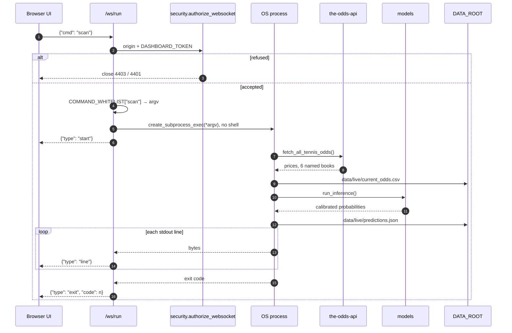
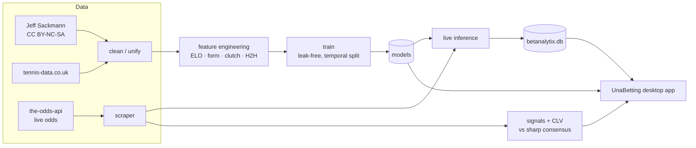
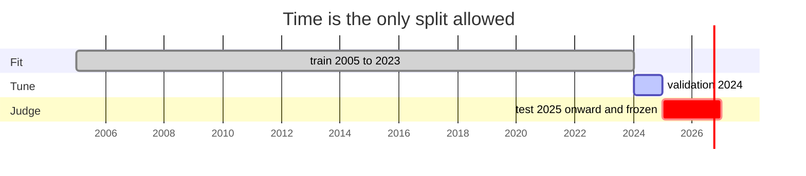
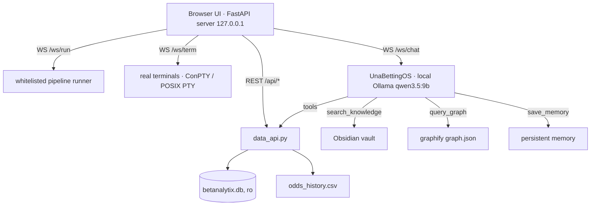
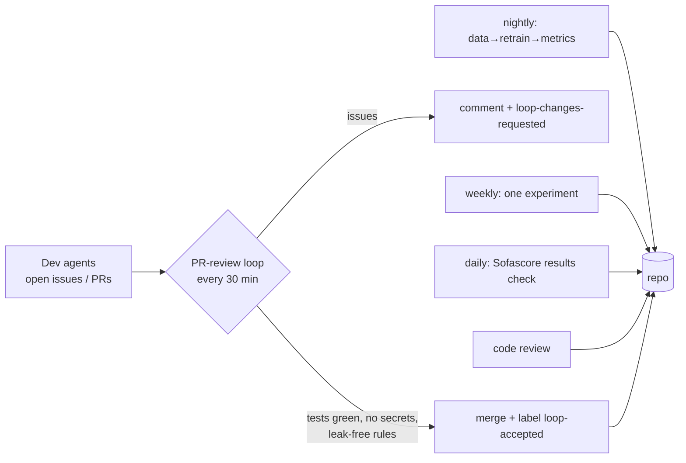
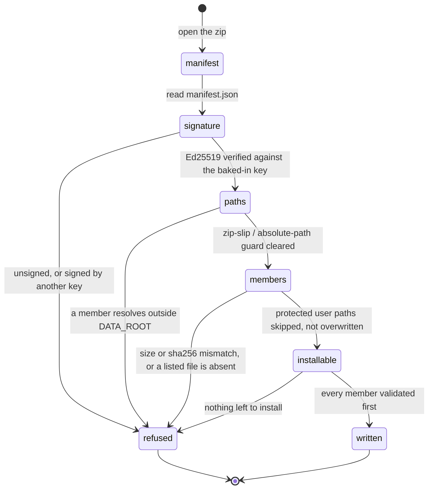

# 🎾 UnaBetting — Tennis Analytics & Honest ML


Open-source tennis analytics (ATP/WTA): a **leak-free ML pipeline**, professional-grade
bet tracking, CLV measurement against sharp lines, and **UnaBetting** — a desktop app
with a data cockpit, integrated terminals, a 3D knowledge graph, an agentic web browser,
and a local-LLM memory core.

Tennis is the *subject*. It is not the discipline. Underneath it this repository joins
**sixteen fields that each have their own idea of what a number means** — machine
learning, feature engineering, statistics, market microstructure, portfolio risk,
meteorology, information retrieval, LLM agents, operating-system interfaces, applied
cryptography, web security, digital signal processing, 3D graphics, cross-platform
packaging, internationalisation and autonomous software process. The interesting
engineering is not inside any one of them; it is at the **seams** where one field's
output has to become another's input.
[Where the domains meet](#where-the-domains-meet) is the map.

**[▶ Explore the live 3D knowledge graph](https://una-betting.vercel.app/graph3d.html)** · **[📖 Docs — deep dive](https://una-betting.vercel.app/docs.html)** · **[Website](https://una-betting.vercel.app/)**

<!--METRICS-->
**Current honest numbers** (test 2025+, updated 2026-06-12): model accuracy **67.4%** · log loss 0.601 · ROC 0.740 · odds-ensemble 69.6% on real-odds rows · honest backtest ROI **-29%** (negative — no betting edge).
<!--/METRICS-->

> ## ⚠️ Honest disclaimer (please actually read it)
> This project's ML model reaches **~67% accuracy** on the out-of-sample 2025+ test set,
> but **has no proven predictive edge**: the honest backtest **loses money** to the
> bookmaker margin. This is a tool for **research, tracking and methodological
> discipline** (CLV, leak detection, bankroll management) — **not** a money machine.
> If you bet: only with licensed operators (in Italy: an ADM concession), only money
> you can afford to lose, 18+. Gambling can be addictive.

**Contents** — [What's inside](#whats-inside) · [Documentation](#documentation) ·
[Where the domains meet](#where-the-domains-meet) · [Architecture](#architecture) ·
[Data flow inside the app](#data-flow-inside-the-app) ·
[Self-evolving loops](#self-evolving-loops) · [Quick start](#quick-start) ·
[Worked examples](#worked-examples) · [Model features](#model-features-excerpt) ·
[Project layout](#project-layout) · [Contributing](#contributing) ·
[Data licenses](#data-licenses--attribution) · [License](#license)

## What's inside

| Component | Description |
|---|---|
| **ML pipeline** | ELO (overall / surface / style), form, fatigue, clutch, H2H, de-vigged odds; strict temporal training (train < 2024, test 2025+), anti-leak perspective randomization, train-only medians |
| **UnaBetting app** | Native desktop window (pywebview): data cockpit, file explorer + editor, whitelisted pipeline runner, real terminals (PowerShell / WSL / tmux), agentic web browser, media preview, bet tracker with equity curve, **UnaBettingOS** local-LLM memory core, 3D knowledge graph, 6 themes, 5 UI languages |
| **Anti-leak** | This project's history is a leak hunt (3 found and fixed, all documented). Regression tests in `tests/`, chronology in `docs/obsidian/`. |
| **CLV infra** | Scheduled multi-book odds snapshots, sharp no-vig consensus (Pinnacle/Betfair), Closing Line Value per signal — the metric of truth |
| **Self-evolving loops** | Scheduled headless agents: nightly maintenance, weekly experiments, daily results check (Sofascore), code review, and a PR-review loop that reviews & merges contributions |

## Documentation

| Document | What it answers |
|---|---|
| [ARCHITECTURE.md](ARCHITECTURE.md) | The layer rule, the file-based seam, the two runtime roots, the trust boundaries, the known structural gaps |
| [docs/adr/](docs/adr/) | Seven decisions, one file each, with what each one cost |
| [docs/DOMAINS.md](docs/DOMAINS.md) | Every seam between the sixteen fields, and what breaks when a handoff is dishonest |
| [docs/EXAMPLES.md](docs/EXAMPLES.md) | Five runnable examples with real captured output |
| [docs/API.md](docs/API.md) | The local HTTP + WebSocket surface the app speaks to itself |
| [docs/LOOPS.md](docs/LOOPS.md) | The scheduled agents, their tiers, their guardrails and their stopping rules |
| [SECURITY.md](SECURITY.md) | Threat model, the origin policy, the signed-update chain, reporting |
| [DATA_SOURCES.md](DATA_SOURCES.md) | Every source, its licence, and the obligations that travel with it |
| [EXPERIMENTS.md](EXPERIMENTS.md) | The ML backlog and journal — including the experiments that failed |
| [CONTRIBUTING.md](CONTRIBUTING.md) | Pathways, priorities, the leak rules, and what a good PR looks like |
| [docs/obsidian/](docs/obsidian/) | The vault the in-app LLM searches, and the source of the 3D graph |

## Where the domains meet

Sixteen fields, and none of them is decoration: each is here because a decision
downstream cannot be made without it. What follows is deliberately **not** a list of
technologies — it is a list of *handoffs*, because that is where this project's bugs
have actually come from. A model probability and a bookmaker price are not the same
kind of object; a PTY is a byte stream and a WebSocket is not; an LLM emits prose and
the betting layer needs a number. [`docs/DOMAINS.md`](docs/DOMAINS.md) tells the whole
story of each seam, including what breaks when a handoff is dishonest.

| Field | The decision it owns | Where it lives |
|---|---|---|
| **Machine learning** | Calibrated match probabilities — calibration, not ranking, because the output is compared against a price | `src/models/train.py`, `src/models/optuna_tuning.py` |
| **Market microstructure** | De-vigging, sharp no-vig consensus, exchange commission, edge, Closing Line Value | `src/betting/signals.py` |
| **Portfolio & risk** | Staking, bankroll, equity curve, realised price vs closing price | `src/betting/portfolio.py` |
| **Statistics & evaluation** | The honest backtest, temporal splits, the refusal to report an inflated number | `src/models/backtest.py`, `EXPERIMENTS.md` |
| **Feature engineering** | ELO per surface and per style, adaptive K, time decay, rolling clutch windows | `src/features/elo.py`, `src/features/build_features.py` |
| **Meteorology & geocoding** | Tournament *name* → coordinates → archived weather, joined as a deliberately symmetric feature | `src/data/scrape_weather.py` |
| **Information retrieval** | Brave → DuckDuckGo → Google News degradation, paragraphs scored against a token budget | `src/live/web_research.py` |
| **LLM agents** | A bounded, attributed probability adjustment — and everything downstream recomputed, never inherited | `src/live/agentic_research.py` |
| **Operating systems** | ConPTY on Windows, POSIX `pty` elsewhere, one interface, real terminals reassembled in a browser | `src/dashboard/pty_process.py`, `src/dashboard/terminal.py` |
| **Web security** | Same-origin policy for an app that is also a local web page; a runner that takes a *name*, never a command line | `src/dashboard/security.py`, `src/dashboard/runner.py` |
| **Applied cryptography** | Ed25519-signed update manifests, because the bundle ships pickled models and `joblib.load` executes code | `src/dashboard/data_api.py`, [`SECURITY.md`](SECURITY.md) |
| **Digital signal processing** | The TUI synthesises its own audio from numpy sine waves — and must run silently when the optional deps are absent | `src/ui/audio_engine.py` |
| **3D graphics & knowledge management** | One `graph.json`, two consumers: three.js wants positions, the in-app LLM wants neighbours | `docs/web/graph3d.html`, `src/dashboard/static/graph3d.js` |
| **Packaging & filesystem** | A read-only bundle root and a writable data root — the same path in a checkout, different ones when frozen | `src/runtime_paths.py`, `packaging/unabetting.spec` |
| **Internationalisation** | Five UI languages through a `t()` dictionary, because a no-build frontend rules out extraction tooling | `src/dashboard/static/app.js` |
| **Autonomous software process** | Scheduled agents that open, review and merge pull requests — with the tier that writes code kept apart from the tier that merges it | `scripts/loops/`, [`docs/LOOPS.md`](docs/LOOPS.md) |

### One click, five domains

The diagrams further down describe *structure*. This one describes *time* — what
actually happens when a user presses **Scan**, the single action that crosses the
most boundaries in the shortest span: a security check, a whitelist lookup, a process
spawn, a paid API call, an inference, two file writes and a byte-stream-to-message
pump, in that order.


```mermaid
sequenceDiagram
  autonumber
  participant UI as Browser UI
  participant WS as /ws/run
  participant SEC as security.authorize_websocket
  participant OS as OS process
  participant API as the-odds-api
  participant ML as models
  participant FS as DATA_ROOT

  UI->>WS: {"cmd": "scan"}
  WS->>SEC: origin + DASHBOARD_TOKEN
  alt refused
    SEC-->>UI: close 4403 / 4401
  else accepted
    WS->>WS: COMMAND_WHITELIST["scan"] → argv
    WS->>OS: create_subprocess_exec(*argv), no shell
    WS-->>UI: {"type": "start"}
    OS->>API: fetch_all_tennis_odds()
    API-->>OS: prices, 6 named books
    OS->>FS: data/live/current_odds.csv
    OS->>ML: run_inference()
    ML-->>OS: calibrated probabilities
    OS->>FS: data/live/predictions.json
    loop each stdout line
      OS-->>WS: bytes
      WS-->>UI: {"type": "line"}
    end
    OS-->>WS: exit code
    WS-->>UI: {"type": "exit", "code": n}
  end
```

The client never sends a command line — it sends the string `"scan"` and the server
looks up the argument vector itself, so there is nothing to escape
([ADR-0004](docs/adr/0004-the-runner-takes-a-name.md)). Inference does not receive a
data frame from the scraper; it reads the CSV the scraper wrote
([ADR-0001](docs/adr/0001-files-as-the-pipeline-seam.md)).

## Architecture

The diagrams below are the shape. **[ARCHITECTURE.md](ARCHITECTURE.md)** is why it
is that shape — the layer dependency rule, the file-based seam between pipeline
stages, the two runtime roots, the trust boundaries, and the structural gaps that
are known and unfixed. The decisions themselves are in
**[docs/adr/](docs/adr/)**, one file each, with what they cost.


```mermaid
flowchart LR
  subgraph Data
    SK[Jeff Sackmann<br/>CC BY-NC-SA] --> CL[clean / unify]
    TD[tennis-data.co.uk] --> CL
    OA[the-odds-api<br/>live odds] --> SC[scraper]
  end
  CL --> FE[feature engineering<br/>ELO · form · clutch · H2H]
  FE --> TR[train<br/>leak-free, temporal split]
  TR --> MD[(models)]
  MD --> INF[live inference]
  SC --> INF
  INF --> DB[(betanalytix.db)]
  SC --> SIG[signals + CLV<br/>vs sharp consensus]
  DB --> APP
  SIG --> APP
  MD --> APP[UnaBetting desktop app]
```

### The split that makes a number honest

`TR` in the diagram above is one box, and it is the box the whole project is built to
protect. The split is **temporal and never random** — `train_start_year: 2005`,
`validation_years: [2024]`, `test_start_year: 2025` in `config/config.yaml` — because
a random split lets a model learn from matches that had not happened yet:


```mermaid
gantt
  title Time is the only split allowed
  dateFormat  YYYY-MM-DD
  axisFormat  %Y
  section Fit
  train 2005 to 2023        :done,   t1, 2005-01-01, 2024-01-01
  section Tune
  validation 2024           :active, t2, 2024-01-01, 2025-01-01
  section Judge
  test 2025 onward and frozen :crit,  t3, 2025-01-01, 2027-01-01
```

Three rules travel with that picture and are enforced in code, not by convention:
raw rows are winner-perspective (`w_*` / `l_*`), so evaluation happens on
**randomised perspective** or the accuracy is inflated by construction; imputation
uses **train-window medians only**; and every `w_X` needs its `l_X` twin, which
`_enforce_perspective_pairs` guarantees. The test window is deliberately frozen so
that two experiments a month apart are comparable
([ADR-0002](docs/adr/0002-leak-freedom-is-structural.md)).

## Data flow inside the app


```mermaid
flowchart TD
  UI[Browser UI · FastAPI server 127.0.0.1] -->|REST /api/*| API[data_api.py]
  UI -->|WS /ws/run| RUN[whitelisted pipeline runner]
  UI -->|WS /ws/term| TERM[real terminals · ConPTY / POSIX PTY]
  UI -->|WS /ws/chat| OS[UnaBettingOS · local Ollama qwen3.5:9b]
  API --> DB[(betanalytix.db, ro)]
  API --> ODDS[odds_history.csv]
  OS -->|tools| API
  OS -->|search_knowledge| VAULT[Obsidian vault]
  OS -->|query_graph| GRAPH[graphify graph.json]
  OS -->|save_memory| MEM[persistent memory]
```

## Self-evolving loops

Scheduled agents that maintain the model, run its experiments and review its pull
requests — each one a versioned prompt in `scripts/loops/`. **[docs/LOOPS.md](docs/LOOPS.md)**
covers the tiers, the separation between the agents that write code and the one
that merges it, the merge gate that uses no model at all, and the stopping rules.


```mermaid
flowchart LR
  DEV[Dev agents<br/>open issues / PRs] --> PR{PR-review loop<br/>every 30 min}
  PR -->|tests green, no secrets,<br/>leak-free rules| MERGE[merge + label loop-accepted]
  PR -->|issues| REQ[comment + loop-changes-requested]
  NIGHT[nightly: data→retrain→metrics] --> REPO[(repo)]
  WEEK[weekly: one experiment] --> REPO
  RES[daily: Sofascore results check] --> REPO
  CR[code review] --> REPO
  MERGE --> REPO
```

## Quick start

**Prerequisites** — Python 3.11+ and `git` on the PATH: the ATP datasets are *cloned*
from their upstream repositories, not downloaded as files. Optional:
[Ollama](https://ollama.com) if you want the in-app chat, and a CPU-only torch wheel
if you would rather not pull several GB of CUDA —
`pip install torch --index-url https://download.pytorch.org/whl/cpu` **before** the
requirements file.

```bash
git clone https://github.com/SandroHub013/UnaBetting.git
cd UnaBetting
pip install -r requirements.txt
cp .env.example .env        # add your API keys (the-odds-api; openrouter optional)

python -m src.data.download           # Sackmann data + historical odds (tennis-data.co.uk)
python -m src.data.clean              # unified dataset
python -m src.features.build_features # feature engineering (~20 min)
python -m src.models.train            # multi-model training + calibration
python -m src.models.backtest         # HONEST backtest (real odds, neutral perspective)

python -m src.dashboard               # UnaBetting (native window on Windows;
                                      # elsewhere: python -m src.dashboard --browser)
```

The in-app chat (UnaBettingOS) defaults to [Ollama](https://ollama.com) with a
tool-calling model (`qwen3.5:9b`, configurable via `CHAT_MODEL`). Its persisted
`chat_settings.json` can instead select the `openrouter` or `openai` provider with an
HTTPS API base URL and an `api_key_env` name such as `OPENROUTER_API_KEY`; the credential
is read from the environment at runtime and is never stored in the settings file.
`GET /api/chat/models` ranks installed Ollama models by full-GPU, partial-GPU, or CPU
fit. Pass `ram_gb` and `vram_gb` query values to override detection on unsupported hardware.

Browser requests to the dashboard APIs and WebSockets are restricted to the local app
origin. Set `DASHBOARD_TOKEN` before launch to additionally require the same session token
on pipeline, terminal, and chat WebSocket connections; the bundled frontend forwards it
automatically.

**Run the tests** — `python -m pytest tests/ -q`. The tests marked `@slow` skip
without the real features dataset; everything else runs from a clean checkout, which
is the same thing CI does on every pull request.

### Configuration

Nothing here is required to *read* the project. These are the five variables that
change how it behaves:

| Variable | What it controls | Default |
|---|---|---|
| `ODDS_API_KEY` | the-odds-api credential. `scan` is the only command in the project that spends paid credits. | unset — live odds disabled |
| `OPENROUTER_API_KEY` | Read from the environment only if the in-app chat is pointed at a remote provider. Never written to `chat_settings.json`. | unset |
| `CHAT_MODEL` | The Ollama model behind UnaBettingOS. | `qwen3.5:9b` |
| `DASHBOARD_TOKEN` | If set, the pipeline, terminal and chat WebSockets additionally require this session token. | unset |
| `UNABETTING_DATA_DIR` | Overrides the writable data root for portable installs and testing. | the repo in a checkout, a per-OS app-data directory when frozen |

The modelling window lives in `config/config.yaml` — `train_start_year: 2005`,
`validation_years: [2024]`, `test_start_year: 2025` — alongside
`odds_api.bookmakers`, which names the six books explicitly instead of requesting
whole regions: fewer credits, and no prices from venues the project cannot use.

### If something does not work

- **The app serves `http://127.0.0.1:8765`, not 8000.** `PORT` in
  `src/dashboard/config.py` is the authority.
- **No native window outside Windows.** `pywebview` is an optional import; use
  `python -m src.dashboard --browser` or `--server-only`.
- **No datasets and no trained artifacts ship with the repo.** `models/*.pkl`, the
  scaler, the medians and `atp_metrics.json` are gitignored — `train` produces them,
  and `backtest` names what is missing if you skip a step.
- **`build_features` takes roughly twenty minutes** on a first run. It is not stuck.
- **The optional dependencies really are optional.** `webview`, `winpty`, `pty`,
  `pygame` and `pyttsx3` are each guarded: the app falls back to a browser window and
  the TUI runs silently rather than failing.

## Worked examples

Three of them, and **every output block below is captured, not illustrative**. None
needs a dataset, a trained model, an API key or a running server: they exercise the
pure functions and the security boundaries, which is exactly the part a reader can
verify from a fresh clone with nothing but `pip install -r requirements.txt`.
Two more — reading an ELO, and proving an evaluation is leak-free — are in
[docs/EXAMPLES.md](docs/EXAMPLES.md).

### 1. Four prices, one signal

Two of these four bookmakers move the market and two follow it; the question a signal
answers is not "who wins" but "is anyone offering more than the price implied by the
books that know".

```python
import pandas as pd
from src.betting.signals import effective_odds, sharp_consensus, find_value_bets

print("effective_odds(3.00, 'betfair_ex_eu') =", round(effective_odds(3.00, "betfair_ex_eu"), 4))
print("effective_odds(3.00, 'williamhill')   =", round(effective_odds(3.00, "williamhill"), 4))

snapshot = pd.DataFrame([
    {"market": "h2h", "p1": "Sinner", "p2": "Alcaraz", "commence_time": "2026-08-27T13:00:00Z",
     "bookmaker": "pinnacle",      "price_1": 1.80, "price_2": 2.10},
    {"market": "h2h", "p1": "Sinner", "p2": "Alcaraz", "commence_time": "2026-08-27T13:00:00Z",
     "bookmaker": "betfair_ex_eu", "price_1": 1.83, "price_2": 2.14},
    {"market": "h2h", "p1": "Sinner", "p2": "Alcaraz", "commence_time": "2026-08-27T13:00:00Z",
     "bookmaker": "williamhill",   "price_1": 1.75, "price_2": 2.25},
    {"market": "h2h", "p1": "Sinner", "p2": "Alcaraz", "commence_time": "2026-08-27T13:00:00Z",
     "bookmaker": "sport888",      "price_1": 1.72, "price_2": 2.05},
])

fair = sharp_consensus(snapshot)
for key, (fp1, fp2, n) in fair.items():
    print("sharp_consensus:", key[0], "vs", key[1],
          "-> fair p1 =", round(fp1, 4), "| fair p2 =", round(fp2, 4), "| n_sharp =", n)

print()
print(find_value_bets(snapshot).to_string(index=False))
```

```text
effective_odds(3.00, 'betfair_ex_eu') = 2.9
effective_odds(3.00, 'williamhill')   = 3.0
sharp_consensus: Sinner vs Alcaraz -> fair p1 = 0.5382 | fair p2 = 0.4618 | n_sharp = 2

           match  player side        book  odds  fair_odds  sharp_fair_prob   edge  n_sharp        commence_time
Sinner v Alcaraz Alcaraz   p2 williamhill  2.25       2.17           0.4618 0.0389        2 2026-08-27T13:00:00Z
```

Three disciplines, eight lines. **Commission belongs to the exchange and not to the
book** — 3.00 on Betfair returns 2.90 because the 5% is taken from the net winnings,
so comparing the two raw prices systematically prefers the venue whose *displayed*
price is better and whose *realised* price is not. **The margin is not information** —
Pinnacle's 1.80/2.10 implies 0.556 + 0.476 = 1.032, and normalising the two sides to
sum to 1 across sharp books only gives the fair pair 0.5382 / 0.4618. **The edge is a
comparison, not a prediction** — Alcaraz's fair price is 2.17, William Hill shows
2.25, so `2.25 × 0.4618 − 1 = +3.89%` clears the 3% floor and becomes a row in the
signal log. Note what is *absent*: the model. A signal is a market observation, and
it is deliberately computable without a prediction.

### 2. Five bundles, one accepted

The in-app updater downloads a zip and unpacks it into the writable data root. That
zip contains **pickled models**, and `joblib.load` executes code when it deserialises
them — so a bundle the client accepts is, in practice, code the user runs. The order
of the checks is therefore the whole security story:


```mermaid
stateDiagram-v2
  [*] --> manifest: open the zip
  manifest --> signature: read manifest.json
  signature --> refused: unsigned, or signed by another key
  signature --> paths: Ed25519 verified against the baked-in key
  paths --> refused: a member resolves outside DATA_ROOT
  paths --> members: zip-slip / absolute-path guard cleared
  members --> refused: size or sha256 mismatch, or a listed file is absent
  members --> installable: protected user paths skipped, not overwritten
  installable --> refused: nothing left to install
  installable --> written: every member validated first
  written --> [*]
  refused --> [*]
```

Five bundles offered to `_extract_runtime_bundle`, with a throwaway signing key
standing in for the release key — the harness is
[docs/EXAMPLES.md §3](docs/EXAMPLES.md#3-refuse-a-bad-update):

```text
a genuine signed bundle            -> accepted, 2 file(s) written
one byte changed after signing     -> REJECTED: size mismatch: models/atp_metrics.json
same files, no signature           -> REJECTED: unsigned bundle — refusing to extract
a member escaping DATA_ROOT        -> REJECTED: unsafe path in bundle: ../evil.txt
a signed bundle over the bet db    -> REJECTED: bundle contains no installable files
   the db on disk is still: the user's wagering history
```

The last row is the one that is not obvious: **a correctly signed bundle still cannot
touch the user's data.** The bet database is on the protected list, so it is *skipped*
rather than overwritten — and once it is skipped the bundle has nothing left to
install, which is why the refusal reads the way it does. A signing key is not a
licence to overwrite a wagering history. The write itself is all-or-nothing: a bundle
that fails on its last member has written nothing from the earlier ones
(`tests/test_updater.py`).

### 3. Five origins, one allowed

The dashboard binds `127.0.0.1`, which is not isolation: every other page open in the
same browser can send it requests. This runs the real FastAPI app through a test
client — no server, no port ([docs/EXAMPLES.md §4](docs/EXAMPLES.md#4-knock-on-the-local-app-from-the-wrong-page)):

```text
no Origin at all (the CLI, curl, this script):
   GET /api/overview                -> 200

the app's own page:
   Origin: http://127.0.0.1:8765    -> 200

some other page in the same browser:
   Origin: https://evil.example             -> 403
   Origin: http://127.0.0.1:9999            -> 403
   Origin: http://user:pw@127.0.0.1:8765    -> 403
   Origin: http://127.0.0.1:8765/path       -> 403
   Sec-Fetch-Site: cross-site                      -> 403

what the pipeline runner will accept as a command:
   names: backtest, clean, download, features, inference, scan, signals, train
   'rm -rf /' -> None

asking a file endpoint to leave the project:
   GET /api/file ../../etc/hosts    -> 403
```

**A missing `Origin` is allowed on purpose.** That is `curl`, the test client and the
CLI — none of which a malicious web page can drive. Requiring the header would break
every non-browser caller while stopping nothing, because the attacker in this model
*is* a browser, and browsers always send one. And the runner's answer to `rm -rf /` is
`None` rather than a refusal, because it never parses a command line at all: it looks
up one of eight names.

## Model features (excerpt)

- **Advanced ELO** — overall + per surface + "style ELO" (vs big servers / returners), adaptive K, time decay
- **Rolling stats** — serve/return/clutch over 10/20/50-match windows, tie-breaks, deciding sets
- **Form & fatigue** — EWM form, decayed minutes over the last 14 days
- **Market** — de-vigged implied probability (B365→PS→Avg) + `has_odds` flag
- **Context** — recent H2H, ranking, age, CPI, points to defend
- **Conditions** — archived temperature, precipitation and wind, geocoded from the tournament name

Three targets: winner (H2H), spread (game diff), totals (over/under).

## Project layout

```
src/
├── data/        download, cleaning, odds scraper (the-odds-api, book allowlist), weather
├── features/    ELO, player stats, clutch, build_features
├── models/      train (anti-leak), honest backtest, cross-validation, Optuna search
├── betting/     signals (value vs sharp + CLV), portfolio (bet tracker)
├── live/        live inference, news agent, web research
├── ui/          Textual TUI + synthesised audio engine
└── dashboard/   UnaBetting app (FastAPI + pywebview + xterm.js), security, updater
packaging/       PyInstaller spec + launcher (frozen builds, per-OS data roots)
scripts/         pipeline helpers + loops/ (scheduled agent prompts) + diagnostics/
docs/            architecture, ADRs, domain map, examples, API, obsidian/ vault, web/
tests/           leak regressions, updater, terminal, dashboard API, live inference
```

## Contributing

See [CONTRIBUTING.md](CONTRIBUTING.md). The priority backlog lives in
[EXPERIMENTS.md](EXPERIMENTS.md). The project's golden rule: **every accuracy claim must
be proven leak-free** (temporal test, randomized perspective, train-only medians) — otherwise
it's a bug, not a result.

## Data: licenses & attribution

The data is **not** ours. In particular, **Jeff Sackmann / Tennis Abstract** datasets are
[CC BY-NC-SA 4.0](https://creativecommons.org/licenses/by-nc-sa/4.0/): attribution required
and **non-commercial use only** — a constraint that extends to any use of this project built
on that data. Details and obligations in [DATA_SOURCES.md](DATA_SOURCES.md). No dataset is
redistributed in this repo.

## License

[MIT](LICENSE) for the **code** — data follows the licenses of its respective sources (above).
The disclaimer at the top travels with the project.
