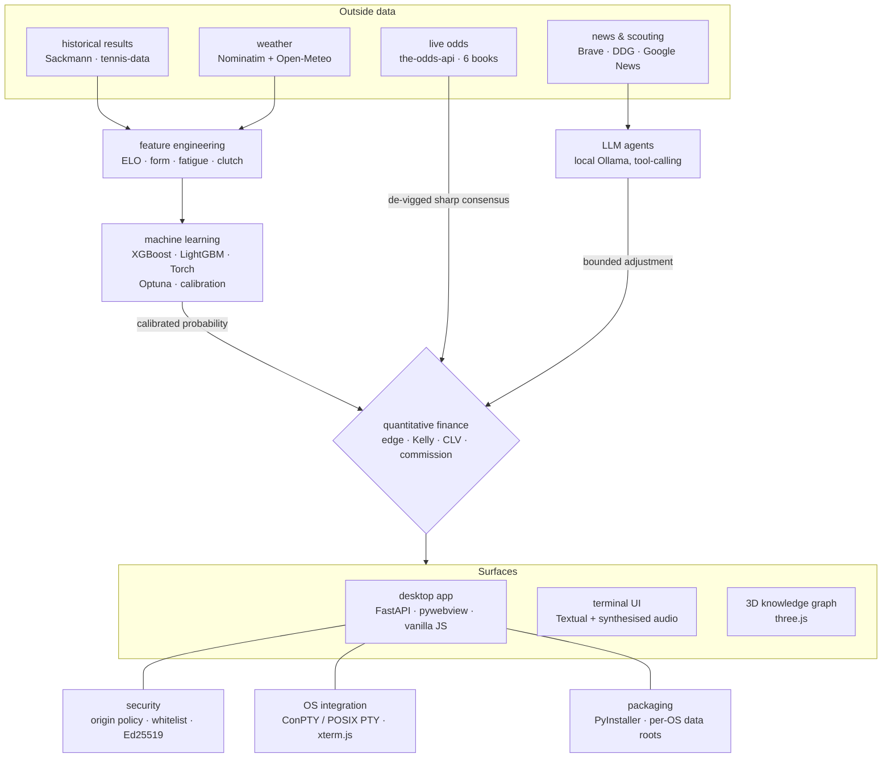
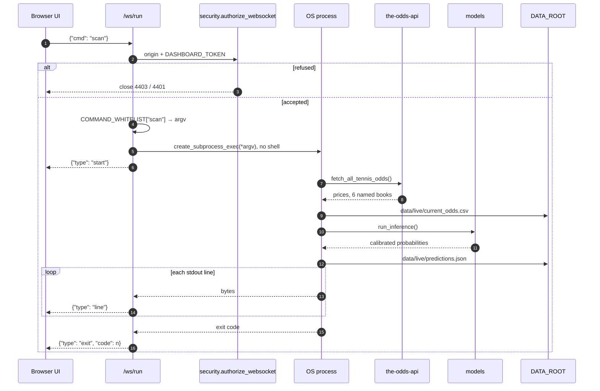

# Where the domains meet

This project looks like one thing — a tennis model — and is built out of about a
dozen. That is not a boast; it is the source of most of its bugs. A feature is
only interesting here if it *changes a decision*, and almost every decision this
project makes requires two fields to agree about what a number means.

So this page is not a list of technologies. It is a list of **seams**: the places
where one domain's output becomes another's input, what has to be true for the
handoff to be honest, and what goes wrong when it is not. [`ARCHITECTURE.md`](../ARCHITECTURE.md)
covers the layering; this covers the disciplines the layers are made of.

---

## 0. One click, five domains

Every diagram in this repository so far describes structure. This one describes
*time* — what actually happens when a user presses **Scan**, which is the single
action that crosses the most boundaries in the shortest span.

Six things in that picture are decisions rather than plumbing, and each belongs
to a different field:

- **The whitelist step is a lookup, not a parse.** The client sent the string
  `"scan"`; the server finds the argument vector itself. No command line ever
  crosses the boundary, so there is nothing to escape
  ([ADR-0004](adr/0004-the-runner-takes-a-name.md)).
- **The spawn uses `create_subprocess_exec`, never a shell**, with the working
  directory and a UTF-8 environment fixed by the server rather than inherited.
- **The odds fetch spends real money.** `scan` is the one whitelisted command
  that consumes paid API credits — which is why it is a deliberate button rather
  than a poll, and why `nightly_maintenance` and `weekly_evolution` are both
  forbidden from calling it ([`LOOPS.md`](LOOPS.md)).
- **The two writes to `DATA_ROOT` are the file seam.** Inference does not receive
  a data frame from the scraper; it reads the CSV the scraper wrote
  ([ADR-0001](adr/0001-files-as-the-pipeline-seam.md)).
- **The output loop is a byte stream inside a message protocol.** A subprocess
  emits bytes whenever it likes; a WebSocket carries discrete frames. The pump
  reads one line at a time and wraps each as JSON, decoding with
  `errors="replace"` so one malformed byte cannot kill the run.
- **Only one command may run at a time.** A second request while one is live is
  refused rather than queued, and a `{"type": "stop"}` frame kills the process.
  The state enforcing that lives in the socket handler, so it dies with the
  connection.

The rest of this page is those boundaries one at a time.

## 1. Machine learning ↔ market microstructure

**The seam:** a model probability and a bookmaker price cannot be compared until
both have been converted into the same object.

A classifier that ranks well can still be useless here. Betting needs
*calibration*, not discrimination: a 60% has to win 60% of the time, because the
decision is a comparison against a price, not a ranking. And the price is not a
probability either — a book's two sides sum to more than 1, and that overround is
its margin. Only after the model is calibrated and the price is de-vigged does
subtracting one from the other mean anything.

That is why `find_value_bets` never looks at a raw model score next to a raw
decimal price. It builds a **no-vig consensus** from the books that actually move
the market (`SHARP_BOOKS`), normalises the two implied probabilities so they sum
to 1, and only then asks whether anyone else is offering a price above the fair
one.

**What goes wrong without it:** every mispriced favourite looks like an edge,
because the overround is sitting in the difference. The project's headline number
exists to make this concrete: **67.4% accuracy and −29% ROI**. Both are true. The
first is a machine-learning result; the second is the financial one, and only the
second is a decision.

| | |
|---|---|
| Calibration, ensembling, Optuna search | `src/models/train.py`, `src/models/optuna_tuning.py` |
| No-vig consensus, edge, signal log | `src/betting/signals.py` |
| Honest financial evaluation | `src/models/backtest.py`, `EXPERIMENTS.md` |

## 2. Two kinds of price are two different instruments

Inside the market domain there is a second seam, and it is the one that quietly
inflates results. A fixed-odds bookmaker's 3.00 pays 3.00. An **exchange's** 3.00
pays 3.00 minus commission on the *net winnings* — about 2.90 at a 5% rate.

`effective_odds` applies the commission only to exchange venues, so a Betfair
price and a William Hill price become comparable numbers before anything is
ranked. Skip it and you systematically prefer the exchange, whose displayed
prices are structurally better and whose realised prices are not.

## 3. Meteorology ↔ feature engineering

**The seam:** results are keyed by tournament *name*; weather is keyed by
*coordinates*.

Bridging them is a geocoding problem, not a modelling one: `clean_tourney_name`
normalises the tournament string, Nominatim resolves it to a latitude and
longitude behind a `RateLimiter` (the service's usage policy is part of the
design, not an afterthought), and Open-Meteo's archive is queried through a
`requests_cache` session wrapped in `retry_requests`. The result is cached to
`data/processed/tourney_weather.csv` and left-joined on `(tourney_name,
tourney_date)`, contributing `temp_max`, `precipitation` and `wind_speed`.

**Why this one is safe by construction:** the weather is a property of the
*match*, not of a player, so both sides of a row receive identical values. A
symmetric feature cannot encode who won — which is exactly what the perspective
rules in [ADR-0002](adr/0002-leak-freedom-is-structural.md) exist to guarantee
for the asymmetric ones.

**Two rough edges, stated:** if the cache file is absent the step prints a warning
and returns the frame untouched, so a fresh clone trains a *different feature set*
than a warm one without failing; and the missing-value fallbacks are fixed
constants (22 °C, 0 mm, 10 km/h) rather than train-window medians. Neither leaks,
but both mean the feature matrix is less reproducible than the rest of the
pipeline.

## 4. LLM agents ↔ probability

**The seam:** a language model produces text; the betting layer needs a number,
and a number that arrived from prose has to be treated as radioactive.

The research layer reads news and scouting pages and may propose an adjustment to
a match probability. The integration rule is that an adjustment is **bounded,
attributed, and fully recomputed downstream**. It is not enough to nudge
`prob_1` — the edge, the value side and the staking all derive from that
probability, and leaving them stale would produce a recommendation that no longer
matches the number it claims to be based on.

`tests/test_live_inference.py::test_agentic_research_recalculates_roi_edge` pins
exactly this: after a +0.05 adjustment the edge must equal
`odds × adjusted_prob − 1`, recomputed, not inherited. The test exists because
the alternative is a system where a model's stated reasoning and its actual
recommendation drift apart silently.

The agent runs against a **local** Ollama model by default with a fixed tool
list — it can query the project's own data, search the Obsidian vault and the
knowledge graph, and save memories. Widening that list is a human review.

## 5. Information retrieval ↔ agent context

Search is its own domain and it is treated as one. `src/live/web_research.py`
degrades through **Brave Search API → DuckDuckGo HTML → Google News RSS**, so an
expired key or a changed markup layout costs quality rather than the whole
feature. Tennis Abstract pages are parsed structurally (slug resolution, table
rows, keyword lines) rather than dumped as text.

The constraint that shapes all of it is the LLM's context window: article bodies
are scored paragraph-by-paragraph and truncated to a character budget before they
are ever shown to a model. Retrieval quality here is measured in *tokens spent
per useful fact*, which is not how a search engine is usually judged.

## 6. Operating systems ↔ the browser

**The seam:** a terminal is a byte stream with in-band escape sequences and a
window size. A WebSocket is a message stream with neither.

The app offers *real* terminals, so both halves have to be built: ConPTY through
`pywinpty` on Windows and the standard library's `pty` on POSIX, behind a single
`pty_process.py` interface, with xterm.js on the browser side reassembling the
byte stream into a screen. Resizing has to cross the same boundary, because
`SIGWINCH` has no WebSocket equivalent.

`tests/test_dashboard_terminal.py` **skips** the POSIX path on Windows instead of
mocking it. A mocked PTY test proves the mock works.

## 7. Packaging ↔ filesystem ↔ cryptography

**The seam:** a Python checkout and a frozen desktop application disagree about
where files live and about who is allowed to write them.

`src/runtime_paths.py` resolves everything through two roots — a read-only
`BUNDLE_DIR` that ships inside the app (`sys._MEIPASS` when frozen) and a
writable `DATA_ROOT` that is the repo in development and the per-OS
application-data directory when packaged. In a checkout the two are the same
path, which is why the split costs a contributor nothing.

Cryptography enters because the updater downloads a bundle of **pickled models**,
and `joblib.load` executes code by construction. The manifest is signed with
Ed25519 and verified against a key baked into the binary before a single member
is read; see [`../SECURITY.md`](../SECURITY.md) for the full order of checks and
[`EXAMPLES.md`](EXAMPLES.md) for them refusing bundles in real time.

## 8. Web security ↔ a local application

**The seam:** the app is a web page, and the user's browser also has other pages
open.

Binding to `127.0.0.1` is not isolation — any page in the same browser can issue
requests to it. So `browser_request_is_cross_origin` rejects `Sec-Fetch-Site:
cross-site` and any `Origin` that is not exactly the app's own, down to refusing
one that carries credentials, a path, a query or a fragment. A **missing**
`Origin` is allowed deliberately: that is `curl`, the test client and the CLI,
none of which a malicious page can drive.

The pipeline runner takes a **name**, never a command line — the client picks one
of eight whitelisted keys and the server looks up the argument vector itself,
running it with `create_subprocess_exec` and no shell. Free-form execution does
exist in this app; it is the terminal, which is honest about being a terminal.

## 9. Signal processing ↔ the terminal UI

`src/ui/audio_engine.py` ships no audio files. It synthesises them: sine waves
generated with numpy, converted to stereo, and handed to `pygame.sndarray` — an
ascending tone when a scan finds something, a descending one when it does not, an
arpeggio, a click, an ambient drone. Spoken summaries go through `pyttsx3` after
the text is stripped of markup that a synthesiser would read aloud.

The integration constraint is that **it must be able to not exist**. `pygame` and
`pyttsx3` are optional imports; when they are unavailable the TUI runs silently
rather than failing. The same rule covers `webview`, `winpty` and `pty`.

## 10. 3D graphics ↔ knowledge management

The project's notes live in an Obsidian vault, which is a graph. `graph3d.html`
renders that graph with three.js as a force-directed 3D scene, and the in-app LLM
reads the *same* `graph.json` through its `query_graph` tool. One artifact, two
consumers with completely different needs — a renderer wants positions and
colours, a language model wants neighbours and labels — and neither is allowed to
own the format.

## 11. Autonomous agents ↔ software process

The loops that maintain this repository are a domain of their own: scheduled
headless agents that open pull requests, review them, run experiments and merge.
The interesting content is not that an LLM edits the repo — it is the constraints:
the tier that writes code is not the tier that merges it, one merge gate uses no
model at all, and the experiment loop reverts its own work when it fails to clear
a stated threshold. [`LOOPS.md`](LOOPS.md) is the whole story.

## 12. Internationalisation ↔ a no-build frontend

Five UI languages (`it`, `en`, `es`, `fr`, `de`) shipped through a `t()`
dictionary in a single vanilla-JS file, because the app must launch from a fresh
clone with nothing but `pip install -r requirements.txt` — which rules out a build
step ([`../ARCHITECTURE.md`](../ARCHITECTURE.md) §7). No extraction tooling, no
bundler, no locale files: a constraint from the packaging domain decides the shape
of the solution in the localisation domain.

---

## What is deliberately *not* integrated

A page about breadth should say where the project stops:

- **No live betting, no bookmaker accounts, no order placement.** The portfolio
  tracker records what a human decided. Nothing in this repository can place a bet.
- **No hosted service.** There is no server component, no user accounts, no
  telemetry. The trust boundaries in §8 exist precisely because everything is local.
- **No datasets in the repo.** Sackmann's data is CC BY-NC-SA; it is fetched, not
  redistributed ([ADR-0006](adr/0006-no-datasets-in-the-repo.md)).
- **No ORM, no frontend framework, no model abstraction layer.** Each was
  considered and rejected in [`../ARCHITECTURE.md`](../ARCHITECTURE.md) §7.

## Where to look

| Domain | Entry point |
|---|---|
| Feature engineering | `src/features/elo.py`, `build_features.py` |
| Models and search | `src/models/train.py`, `optuna_tuning.py` |
| Quantitative layer | `src/betting/signals.py`, `portfolio.py` |
| Weather | `src/data/scrape_weather.py` |
| Retrieval and agents | `src/live/web_research.py`, `agentic_research.py` |
| Desktop app and API | `src/dashboard/`, [`API.md`](API.md) |
| Terminals | `src/dashboard/pty_process.py`, `terminal.py` |
| Packaging and updates | `src/runtime_paths.py`, `packaging/unabetting.spec` |
| Audio | `src/ui/audio_engine.py` |
| Autonomous loops | `scripts/loops/`, [`LOOPS.md`](LOOPS.md) |
