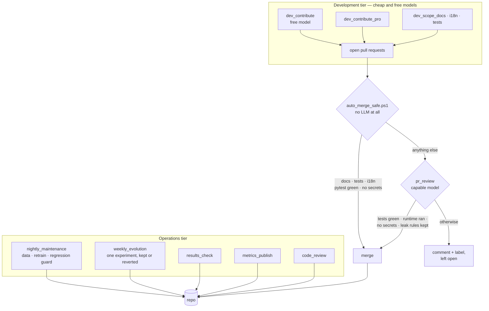

# The loops

Most of this repository is a tennis model. This part is not: it is the machinery
that maintains the model, runs its experiments, reviews its pull requests and
merges them — scheduled agents, each one a versioned prompt living in
`scripts/loops/`, executed headless.

It is written down here because it is the part of the project a reader is most
likely to mistake for a gimmick, and because the interesting content is not "an
LLM edits the repo". It is the constraints under which it is allowed to.

## The shape

## Cost is a design parameter, not an afterthought

`scripts/loops/run_loop.ps1` maps each loop to the cheapest model that can do it:

| Loop | Model | Job |
|---|---|---|
| `pr_review` | capable | review and merge public PRs |
| `code_review` | capable | deep model/system review, every three days |
| `weekly_evolution` | mid | one experiment from the backlog |
| `nightly_maintenance` | mid | data refresh, retrain, regression guard |
| `docs_repo_sync` | mid | docs, translations, public-repo sync |
| `metrics_publish` | mid | publish metrics to app, site and README |
| `results_check` | small | run a script, summarise |

The development tier is cheaper still — `dev_contribute.md` runs on a *free*
model and behaves as an external contributor.

And one gate uses **no model at all.** `auto_merge_safe.ps1` merges a PR only if
every changed file is under `tests/`, `docs/`, a `.md`/`.txt`, or a UI JavaScript
file that passes `node --check`; the diff matches no secret-shaped pattern; and
`pytest` is green on the checkout. Anything else it leaves alone. That is the
whole point of it: a docs typo should not consume a review slot on the expensive
loop.

## Separation of powers

The rule that makes the rest safe: **the tier that writes code is not the tier
that merges it.**

Development loops open pull requests and are told, in the prompt, never to push
to `main`, never to force-push, never to merge their own PR, and never to touch
`src/betting/` — the live betting code — at all. The review loop merges. Nothing
merges itself.

The review loop's own bar, from `pr_review.md`, is five conditions, and the
fifth is the one worth reading:

> **Behavioural verification (don't trust pytest alone).** If the PR touches
> `src/live`, `src/features`, `src/models`, `warm_up`, or the scan/inference
> path, actually RUN the affected runtime […] Unit tests pass while these break —
> this is exactly how the live scan got merged broken. If you CANNOT run the
> runtime path, do NOT merge.

That sentence is there because it happened. The other four are: green tests, no
secrets or personal data in the diff, the anti-leak rules from `CONTRIBUTING.md`
respected when the PR touches models or evaluation
([ADR-0002](adr/0002-leak-freedom-is-structural.md)), and scope coherence.

An accuracy claim without reproducible before/after numbers is an automatic
request for changes.

## The loops that can say no to themselves

Two stopping rules, both in the prompts:

- **`weekly_evolution` reverts its own work.** It implements one experiment,
  evaluates it honestly — temporal test, randomized perspective, train-only
  medians — and compares against the baseline band. If it does not clear
  +0.3 points of accuracy or −0.005 log loss without worsening the other, the
  loop restores the code it just wrote and records the failure with its numbers
  in `EXPERIMENTS.md`. A negative result is a result: E1 spent a full cycle to
  establish that serve-stat coverage is *not* the accuracy lever.
- **Three consecutive failures halt it.** The loop writes `LOOP HALTED — needs
  human decisions` at the top of `EXPERIMENTS.md` and stops. An agent that keeps
  trying after three misses is not exploring, it is thrashing.

`nightly_maintenance` has a narrower version of the same discipline. It is told
to be conservative, to note a failed step and continue rather than improvise
structural fixes, and it may touch `EXPERIMENTS.md` in exactly one case: to file
an `## Alerts` entry when accuracy drops more than a point or log loss rises more
than 0.01 between the last two rows of `reports/metrics_history.csv`. Everything
else in that file belongs to the weekly loop.

Neither loop may call the paid odds API. Neither may push to a remote.

## What is versioned

The prompts are. `scripts/loops/*.md` are files in the repository, reviewed in
pull requests like any other code, and `run_loop.ps1` does nothing but pick a
model and say *"Read and execute the instructions in
`scripts/loops/<name>.md`"*. Changing what an agent does is a diff.

Runs land in `reports/loops/` and are pruned after thirty days; the dashboard
reads them through `GET /api/loops`.

## Rough edges

Written down because a page about automation that reports no friction is not
describing automation:

1. **The cadence is stated twice and the two disagree.** `run_loop.ps1` comments
   that `pr_review` runs every 4 h; `pr_review.md` tells the agent it runs every
   ~6 h and to budget accordingly. The schedule itself lives outside the repo, in
   the task scheduler, which is why neither is authoritative.
2. **A loop cannot approve a PR from the account that owns the repository.**
   GitHub blocks self-approval, so the review loop records its verdict as a
   comment plus a label (`loop-accepted`, `loop-changes-requested`,
   `loop-automerged`) and treats the formal approval as best-effort. Merge works
   regardless — which means the durable record of *why* something merged is a
   comment, not a review.
3. **Scheduling is not in the repository.** These are prompts and runners; what
   actually invokes them is a machine-local scheduler. A fresh clone gets the
   loops without getting the loop.
4. **`auto_merge_safe.ps1` hard-codes a working directory** as a default
   parameter. It takes an override, but the default is one machine's path.

## Where the pieces are

| | |
|---|---|
| Loop prompts | `scripts/loops/*.md` |
| Runner and the model map | `scripts/loops/run_loop.ps1` |
| Development-tier runners | `scripts/loops/run_dev_loop*.ps1`, `run_dev_loop.sh`, `run_dev_scoped.ps1` |
| The no-LLM merge gate | `scripts/loops/auto_merge_safe.ps1` |
| Experiment backlog and journal | [`EXPERIMENTS.md`](../EXPERIMENTS.md) |
| Run logs | `reports/loops/`, and `GET /api/loops` |
