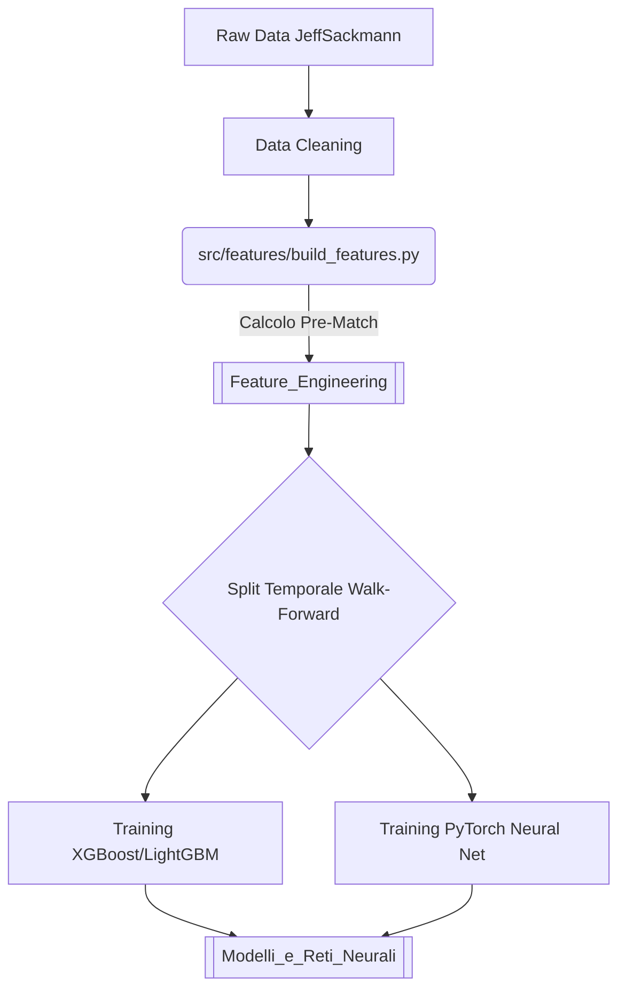

---
tags:
  - architecture
  - pipeline
---

# Architettura del Sistema 

L'architettura è stata snellita per massimizzare la velocità di iterazione sui modelli predittivi, rimuovendo il rumore di portafoglio/bookmaker.

## 📊 Pipeline Dati
Il flusso dei dati è strettamente lineare per evitare il famigerato *Data Leakage*.

## 🔄 Risoluzione Colli di Bottiglia
In passato, l'estrazione dati soffriva di un bottleneck `O(n*m)` nel file `src/features/player_stats.py`. La scansione della cronologia di un giocatore per filtrare i match sulla singola superficie rallentava l'estrazione esponenzialmente.
**Soluzione:** È stata introdotta una dictionary cache `player_surface_matches` che azzera la complessità iterativa.
